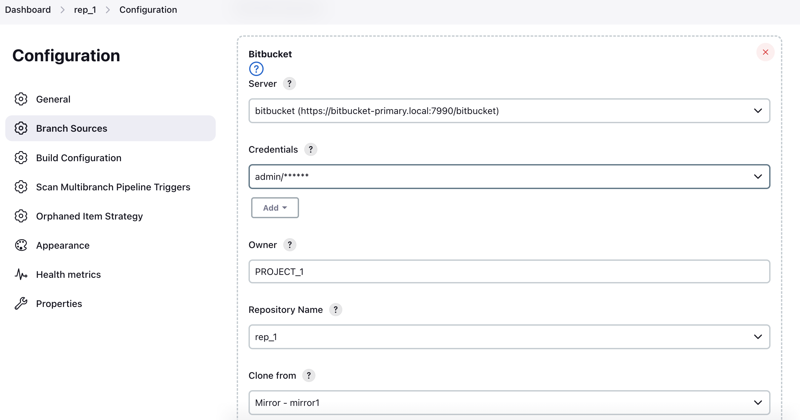

= Bitbucket Branch Source Plugin

[IMPORTANT]
=====================================================================
On March 5th, 2020, link:https://confluence.atlassian.com/bitbucketserver/bitbucket-server-7-0-release-notes-990546638.html[Atlassian releases Bitbucket Server 7] which removed some undocumented features related to pull requests.

. With Bitbucket Server 7.x, Jenkins Pipeline jobs can no longer perform a lightweight checkout of the `Jenkinsfile` if you are using the merge strategy for builds.
.. This is due to Bitbucket Server 7.x no longer storing the merge commit for PRs to `refs/pull-requests/*/merge` which was a prerequisite for lightweight checkout.
.. Bitbucket Server Pipeline jobs will automatically fall back to heavyweight checkout.
.. link:https://jira.atlassian.com/browse/BSERV-12284?focusedCommentId=2389584&page=com.atlassian.jira.plugin.system.issuetabpanels%3Acomment-tabpanel#comment-2389584[Atlassian has explained their reasons for making this change] and has made it clear they will not be re-adding this behavior.
. For Jenkins Pipeline jobs to function for pull requests on Bitbucket Server 7.x, you need to enable "Call Changes api" option in the plugin configuration.
.. Bitbucket Server 7.x no longer automatically creates the required refs for pull requests. Calls to this new API are required to trigger ref creation.

=====================================================================

[id=bitbucket-sect-intro]

_Bitbucket Branch Source plugin_ allows use of Bitbucket Cloud and Server
as a multi-branch project source in two different ways:

 * *Single repository source*: automatic creation of jobs for branches and pull requests in a specific repository.
 * *Organization folders*: automatic creation of multi-branch projects for each visible repository in a specific Bitbucket Team or Project.

 IMPORTANT: This plugin is not compatible with versions of Bitbucket Server previous to 4.0.

[id=bitbucket-server-7]
== Bitbucket Server 7 compatibility

_Bitbucket Server 7.x_ is supported but does no longer support lightweight checkout for pull requests when merge strategy is used for build.

IMPORTANT: In order to have the pull request process working the "Call Changes api" option must be
enabled in _Manage Jenkins_ » _Configure System_

[id=bitbucket-scm-source]
== Branches and pull requests auto-discovering

This plugin adds an additional item in the "Branch Sources" list of multi-branch projects.
Once configured, branches and pull requests are automatically created and built as branches in the multi-branch project.

Follow these steps to create a multi-branch project with Bitbucket as a source:

. If using Bitbucket Server, the server base URL needs to be added to the Bitbucket Endpoints first in the "Manage Jenkins" > "System" configuration.
. Create the multi-branch project. This step depends on which multi-branch plugin is installed.
For example, "Multibranch Pipeline" should be available as a project type if Pipeline Multibranch plugin is installed.
+
image::images/screenshot-1.png[scaledwidth=90%]

. Select "Bitbucket" as _Branch Source_
+
image::images/screenshot-2.png[scaledwidth=90%]

. Set credentials to access Bitbucket API and checkout sources (see "Credentials configuration" section below).
. Set the repository owner and name that will be monitored for branches and pull requests.
+
image::images/screenshot-4.png[scaledwidth=90%]

. Finally, save the project. The initial indexing process will run and create projects for branches and pull requests.
+
image::images/screenshot-5.png[scaledwidth=90%]

[id=bitbucket-scm-navigator]
== Organization folders

_Bitbucket Team/Project_ repository source can be used in Organization Folder to automatically track branches and pull requests in all Bitbucket Team or Project repositories.

. Create a project of type _Organization Folder_.
+
image::images/screenshot-6.png[scaledwidth=90%]

. Add _Bitbucket Team/Project_ repository source
. If you configured more than one _Bitbucket Endpoint_, choose the _Server_ and appropriate _Credential_
. Configure the repository owner. It could be:
.. A Bitbucket Cloud Workspace ID (slug): all repositories in the workspace are imported as Multibranch projects.
.. A Bitbucket Server Project ID: all repositories in the project are imported as Multibranch projects. *Note that the project ID needs to be used instead of the project name*.
.. A regular username: all repositories which the username is owner of are imported.
+
image::images/screenshot-8.png[scaledwidth=90%]

. Save the configuration. The initial indexing process starts. Once it finishes, a Multibranch
project is created for each repository.
+
image::images/screenshot-9.png[scaledwidth=90%]

[id=bitbucket-webhooks]
== Webhooks registering

The use of https://confluence.atlassian.com/bitbucket/manage-webhooks-735643732.html[Bitbucket webhooks]
allows to trigger builds on branches and pull requests just when a new commit is done. Bitbucket plugin exposes a special
service to listen to these webhook requests and acts accordingly by triggering a new reindex and finally
triggering builds on matching branches or pull requests.

Go to "Manage Jenkins" / "Configure System" and locate _Bitbucket Endpoints_. For every endpoint where you want webhooks registered automatically,
check "Manage hooks" and select a "Credential" with enough access to add webhooks to repositories. Since the Credential is used at the system level,
it can be a System scoped credential, which will restrict its usage from Pipelines.

For both Bitbucket _Multibranch Pipelines_ and _Organization folders_ there is an "Override hook management" behavior
to opt out or adjust system-wide settings.

image::images/screenshot-4.png[scaledwidth=90%]

IMPORTANT: In order to have the auto-registering process working fine the Jenkins base URL must be
properly configured in _Manage Jenkins_ » _Configure System_

[id=bitbucket-creds-config]
== Credentials configuration

The configuration of the plugin (for both _Bitbucket multibranch pipelines_ and _Bitbucket Workspace/Project organization folders_) has
two credentials to configure:

. *Scan Credentials*: Credentials used to access Bitbucket API in order to discover repositories, branches and pull requests.
If not set then anonymous access is used, so only public repositories, branches and pull requests are discovered and managed.
HTTP Basic Authentication, Access Token and OAuth credentials are supported.
. *Checkout Credentials*: Credentials used to check out sources once the repository, branch or pull request is discovered.
HTTP Basic Authentication, SSH and OAuth credentials are supported.
If not set, then _Scan Credentials_ are used.

image::images/screenshot-3.png[scaledwidth=90%]

=== Access Token

The plugin can make use of a personal access token (Bitbucket Server only) instead of the standard username/password.

First, create a new _personal access token_ in Bitbucket as instructed in the link:https://confluence.atlassian.com/bitbucketserver080/http-access-tokens-1115142284.html[HTTP access tokens | Bitbucket Data Center and Server 8.0 | Atlassian Documentation].
At least allow _read_ access for repositories. If you want the plugin to install the webhooks, allow _admin_ access for repositories.

Then create a new _Username with password_ credential in Jenkins, enter the Bitbucket username (not the email) in the _Username_ field and the created access token in the _Password_ field.

=== App Passwords

Bitbucket https://community.atlassian.com/t5/Bitbucket-articles/Announcement-Bitbucket-Cloud-account-password-usage-for-Git-over/ba-p/1948231[deprecated usage of Atlassian account password] for Bitbucket API and Git over HTTPS starting from March 1st, 2022 (Bitbucket Cloud only).

The plugin can make use of an app password instead of the standard username/password.

First, create a new _app password_ in Bitbucket as instructed in the https://support.atlassian.com/bitbucket-cloud/docs/app-passwords/[Bitbucket App Passwords Documentation]. At least allow _read_ access for repositories. Also, you may need to allow _read_ and _write_ access for webhooks depending on your pipeline's triggers.

Then create a new _Username with password credentials_ in Jenkins, enter the Bitbucket username (not the email) in the _Username_ field and the created app password in the _Password_ field.

 IMPORTANT: App passwords do not support email address as a username for authentication. Using the email address will raise an authentication error in scanning/checkout process.

=== OAuth credentials

The plugin can make use of OAuth credentials (Bitbucket Cloud only) instead of the standard username/password.

First create a new _OAuth consumer_ in Bitbucket as instructed in the https://confluence.atlassian.com/bitbucket/oauth-on-bitbucket-cloud-238027431.html[Bitbucket OAuth Documentation].
Don't forget to check _This is a private consumer_ and at least allow _read_ access for repositories and pull requests. If you want the plugin to install the webhooks, also allow _read_ and _write_ access for webhooks.

image::images/screenshot-10.png[scaledwidth=90%]

Then create new _Username with password credentials_ in Jenkins, enter the Bitbucket OAuth consumer key in the _Username_ field and the Bitbucket OAuth consumer secret in the _Password_ field.

image::images/screenshot-11.png[scaledwidth=90%]

image::images/screenshot-12.png[scaledwidth=90%]

[id=bitbucket-mirror-support]
== Mirror support

A mirrored Git repository can be configured for fetching references.

The mirror is not used in the following cases:

- If the source branch in a pull request resides in a different repository, the source branch is fetched from the primary repository while the target branch is fetched from the mirror.

- During initial pull request scanning, the mirror isn't used because of the current design limitations.

Cloning from the mirror can only be used with native web-hooks since plugin web-hooks don't provide a mirror identifier.

For branches and tags, the mirror sync event is used. Thus, at cloning time, the mirror is already synchronized. However, in the case of a pull request event, there is no such guarantee. The plugin optimistically assumes that the mirror is synced and the required commit hashes exist in the mirrored repository at cloning time. If the plugin can't find the required hashes, it falls back to the primary repository.

[id=bitbucket-misc-config]
== Miscellaneous configuration

In case of slow network, you can increase socket timeout using the link:https://jenkins.io/doc/book/managing/script-console/[Script Console]:

[source,groovy]
----
System.setProperty("http.socket.timeout", "300") // 5 minutes
----
